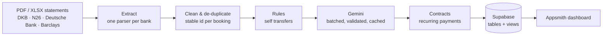

# Kubera Finance

**Bank statements in, categorised transactions out.** Kubera reads PDF and Excel
statements from German banks, cleans and de-duplicates the bookings, categorises
them with Google Gemini, detects recurring contracts, and loads the result into
Supabase, where the [Kubera dashboard](https://github.com/Pavatharini-Muthukkumar/kubera_finance_app_ui)
(Appsmith) shows monthly income, spending and balances.


## How it works



| Stage | What it does |
|---|---|
| **Extract** | Detects the bank from the statement header, then parses bookings, counterparty IBANs and the closing balance. |
| **Clean** | One schema for all banks; ISO week, month, quarter; text stripped of amounts, IBANs and noise. |
| **De-duplicate** | Every booking gets a stable id, so overlapping statements never double-count, while two identical purchases on one day are both kept. |
| **Self transfers** | Money moved between your own accounts (by IBAN or by your name) is excluded from income and spending, decided by rule before any model call. |
| **Categorise** | Gemini places each distinct text into a fixed category table (14 main categories, 58 subcategories). About 40 texts per call; answers outside the table are rejected and queued for manual review; results are cached so a re-run costs nothing. |
| **Contracts** | Payments to the same counterparty on a weekly, monthly, quarterly or yearly grid, with a steady amount. One late payment does not hide a contract. |
| **Dashboard data** | SQL views compute every number the dashboard shows: monthly totals, category spending, balances, contracts and the review queue. |

## Quick start

```bash
git clone https://github.com/Pavatharini-Muthukkumar/Kubera_Finance_app.git
cd Kubera_Finance_app
python -m venv .venv && source .venv/bin/activate
pip install -e ".[supabase,dev]"

# try it on the bundled synthetic card export, without an API key
kubera run --input examples --out out --no-llm
```

```
10 transactions -> out/transactions.csv
  duplicates dropped:   0
  self transfers:       0
  recurring contracts:  1
  need manual category: 10 -> out/needs_review.csv
  accounts with balance: 1 -> out/accounts.csv
```

## Your own statements

1. `cp .env.example .env` and add your `GEMINI_API_KEY` (and Supabase keys to upload).
2. `cp kubera.example.toml kubera.toml` and add your names and IBANs. This file is
   git-ignored: **nothing personal lives in the code.**
3. Put statements in `transactions/` (git-ignored) and run:

```bash
kubera run                 # extract, clean, categorise, detect contracts -> out/
kubera run --upload        # ... and upsert into Supabase
kubera upload              # upload an earlier run's out/ folder
```

Re-running is always safe: bookings are matched by id, so nothing is duplicated
locally or in Supabase.

## Supabase setup

Run [`sql/schema.sql`](sql/schema.sql) once in the Supabase SQL editor. It creates
the `transactions` and `accounts` tables and the views the dashboard reads:

| View | Used for |
|---|---|
| `v_months` | month dropdown |
| `v_monthly_summary` | income, expenses, net per month (own transfers excluded) |
| `v_category_expenses`, `v_subcategory_expenses` | spending chart and drill-down; uncategorised bookings appear as *Uncategorised* so the chart adds up to the totals |
| `v_total_balance`, `v_account_balances` | balance card |
| `v_contracts` | recurring payments and next due date |
| `v_needs_review` | bookings that still need a category |

## Project layout

```
kubera/
  extractors/      one module per bank + detection
  transform.py     schema, derived fields, de-duplication, self transfers
  categorize.py    Gemini batching, validation, cache
  contracts.py     recurring payment detection
  pipeline.py      the stages as one call
  upload.py        Supabase upsert
  cli.py           `kubera` command
sql/schema.sql     tables and dashboard views
tests/             synthetic statements, no real data
examples/          synthetic demo export
```

## Tests

```bash
pytest
```

All tests run on synthetic statement text: no real bank data, no API key and no network needed.

## Privacy

Statements, outputs, `.env`, `kubera.toml` and the category cache are all
git-ignored. The repository contains only code and synthetic examples.

## Author

**Pavatharini Muthukkumar** · [LinkedIn](https://www.linkedin.com/in/pavatharini-muthukkumar)
